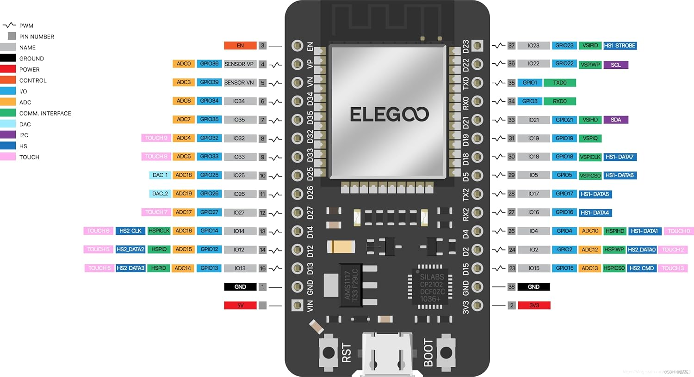
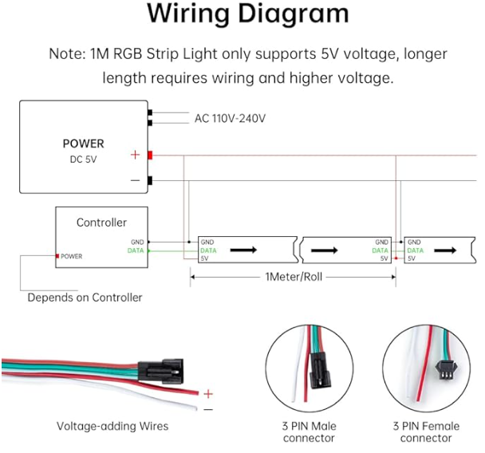
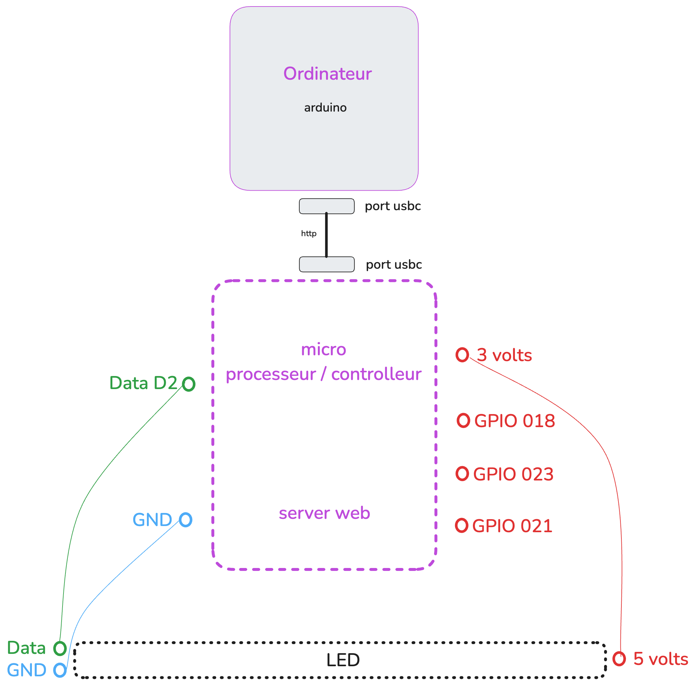

# LED Connectée avec ESP32 + WS2812B

Project to control a LED.

## Material
- ESP32 (micro controler)
- Bande LED WS2812B
- Alimentation 5V
- Câbles arduino mâle / femelle
- Câble USB (to transfer data) 

### Install Arduino IDE ###   
https://www.arduino.cc/en/software

### Dependencies ### 
**In boards manager :**
- esp32 by Expressif Systems
- Arduino ESP32 Boards by Arduino

**In Aduino IDE -> Preferences -> Settings -> Additionnals Boards Manager Url :**
- https://raw.githubusercontent.com/espressif/arduino-esp32/gh-pages/package_esp32_index.json

**Driver (for mac) CP210x Mac OSX Driver :**
- https://www.silabs.com/developer-tools/usb-to-uart-bridge-vcp-drivers?tab=downloads

## Setup
**Board and Port**
- select ESP32 Dev Module and port

## To help
**Guide de démarrage carte ESP32 GT0162 :**
- https://www.gotronic.fr/pj2-38527---gt0162-3214.pdf

**Ports :**
- 

**Diagram :**
- 

**Alim :**
- 

**My install schema :**
- 
